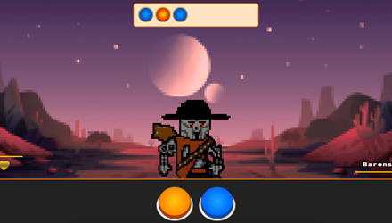
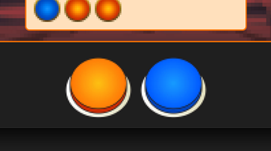
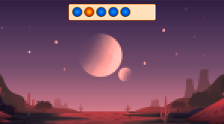

# Blaster Duel Redemption

## Date: 5/04/2023

### By: Anthony Medina

[Website](https://www.anthonyjmedina.com/) | [GitHub](https://github.com/ajm24027) | [LinkedIn](https://www.linkedin.com/in/anthonyjmedina/) | [Trello](https://trello.com/w/design_playground/home) | [Game](https://playbdr.surge.sh)

---

### **_Description_**

Fight your way to save your family's land in this pattern-based first person shooter game. As a blaster pistol duelist, it's up to you defeat evil Space Barons who want to turn your planet into a Space Cow Farm. Use your quick reflexes and memory skills to load the correct pattern into your blaster and win duels. Do you have what it takes to become the fastest blaster in Wild Space?

---

### **_Technologies_**

- Adobe Photoshop
- Adobe Illustrator
- JS
- HTML
- CSS

---

### **_Getting Started_**

#### **The Story So Far** 🐮

You play as a blaster pistol duelist in Wild Space, where your family's land is being illegally seized by Space Barons who want to turn your planet into one big Space Cow Farm. The Barons follow The Code of the Duel and have to accept challenges to duels. Upon losing a duel, they must give up all of their land and property to the winner.

#### **How to Play** 🔫

1. To start the game, click on the "Start Game" button on the main menu screen (for full immersion, allow your browser to play sound).
2. Once the game has started, a pattern will appear at the top of the duel area. Study the pattern carefully as you will need to input it correctly into your blaster.
3. To input the pattern, use the console controls consisting of two large buttons (orange and blue). Click on the corresponding circle to fill the next available slot until the pattern is complete or the time runs out.
4. If you successfully input the correct pattern within the time limit, you will hit your mark and win the duel.
5. The next duel will have a pattern with one more random circle within it. After a certain number of rounds, the time you have to complete each pattern will get shorter and shorter.
6. The game ends when you successfully defeat all the Space Barons and reclaim your family's land.

##### **Button Controls** 🟠🔵

- To input the pattern, use the console controls consisting of two large buttons (orange and blue).
- Click on the corresponding circle to fill the next available slot until the pattern is complete or the time runs out.

#### **Tips & Tricks**

- Memorize the pattern as quickly as possible to have more time to input it into your blaster.
- Take your time to input the correct pattern, rushing can cause mistakes.
- Practice makes perfect, so keep playing to improve your skills.

Good luck becoming the fastest blaster in Wild Space!

---

### **_Screenshots_**

  

---

### **_Future Updates_**

1. [✅] ~~Set appropriate 8 Bit Western Music~~
2. [✅] ~~Add proper 8-bit dueling sound effects.~~
3. [✅] ~~Better representation of the duelists.~~
4. [ x ] Round Timer (Possibly underneath the Round Header).

---

### **_Credits_**

Character Sprites created by: [@brugetsu.games](https://play.google.com/store/apps/details?id=com.Brugetsu.inc) 
Splash Background by: [KVACM](https://kvacm.artstation.com/projects/BmA8Ak) 
Font Awesome by Dave Gandy - http://fontawesome.io
